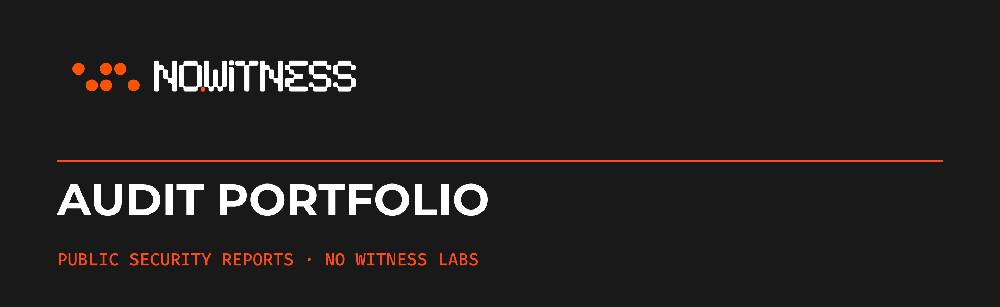
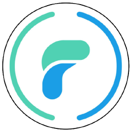

  

<strong>Security-first smart contract development.</strong>

This repository is the public security audit portfolio of No Witness Labs. It
contains approved final reports for completed client engagements.

## Public audit reports

| Project | Audited system | Technology | Completed | Report |
| --- | --- | --- | --- | --- |
| <a href="https://github.com/FluidTokens/ft-cardano-loans-v3"> <strong>FluidTokens</strong></a> | Loans V3: resellable loan flows | Cardano · Aiken | 2026-04-06 | [PDF](audits/fluidtokens/2026-04-06-loans-v3-resellable-loans.pdf) |
| <a href="https://github.com/input-output-hk/lace-platform"> <strong>Lace</strong></a> | Browser Extension security assessment: round 2 | Browser extension · TypeScript | 2026-02-27 | [PDF](audits/lace/2026-02-27-browser-extension-round-2.pdf) |
| <a href="https://github.com/FluidTokens/ft-cardano-loans-v3"> <strong>FluidTokens</strong></a> | Cardano Loans V3: new liquidation flows | Cardano · Aiken | 2026-02-27 | [PDF](audits/fluidtokens/2026-02-27-cardano-loans-v3-new-liquidation.pdf) |
| <a href="https://github.com/pondora-org/echo-validators"> <strong>Pondora</strong></a> | Echo consensus membership and state contracts | Cardano · Aiken | 2026-02-27 | [PDF](audits/pondora/2026-02-27-echo-contracts.pdf) |
| <a href="https://github.com/input-output-hk/lace-platform"> <strong>Lace</strong></a> | Mobile app security assessment | Mobile · React Native | 2026-01-26 | [PDF](audits/lace/2026-01-26-mobile-app.pdf) |
| <a href="https://github.com/danogo-finance/oracle-aggregator"> <strong>Danogo</strong></a> | Oracle Aggregator | Cardano · Aiken | 2025-12-26 | [PDF](audits/danogo/2025-12-26-oracle-aggregator.pdf) |
| <a href="https://github.com/yaadlabs/DAO"> <strong>YaadLabs</strong></a> | DAO smart contracts | Cardano · Aiken | 2025-11-27 | [PDF](audits/yaadlabs/2025-11-27-dao-smart-contracts.pdf) |
| <a href="https://github.com/input-output-hk/lace-platform"> <strong>Lace</strong></a> | Midnight Preview browser extension and API | Browser extension · TypeScript | 2025-11-21 | [PDF](audits/lace/2025-11-21-midnight-preview-extension.pdf) |
| <a href="https://danogo.io/"> <strong>Danogo</strong></a> | Flexible Rate Lending v1.3 | Cardano · Aiken | 2025-11-19 | [PDF](audits/danogo/2025-11-19-flexible-rate-lending-v1.3.pdf) |
| <a href="https://github.com/pondora-org/pondora-contracts-audit"> <strong>Pondora</strong></a> | Pondora contracts | Cardano · Aiken | 2025-11-19 | [PDF](audits/pondora/2025-11-19-pondora-contracts.pdf) |
| <a href="https://btcgrow.io/"> <strong>BTC Grow</strong></a> | Non-custodial BTC yield routing validators | Cardano · Aiken | 2025-09-30 | [PDF](audits/btc-grow/2025-09-30-btc-grow.pdf) |

File checksums are recorded in the [report index](audits/README.md).

## About the reports

Each report describes a bounded review of the source, scope, and assumptions
identified for that engagement. A report is not a certification, does not
guarantee that no vulnerabilities exist, and does not cover changes made after
the reviewed source revision.

The copies in this repository were approved for public release and are
preserved as delivered, including any engagement-era document-control labels.

## Request an audit

Visit [nowitnesslabs.com](https://nowitnesslabs.com/) to discuss scope and
availability.

## Copyright

Reports, No Witness Labs brand assets, and client marks are subject to the
[repository copyright notice](COPYRIGHT.md).
